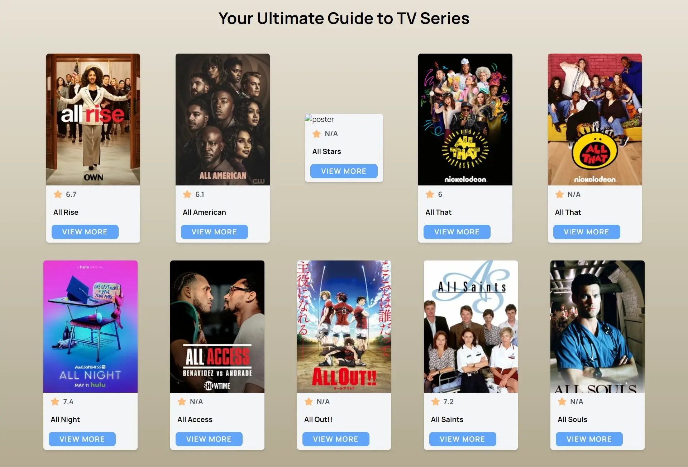
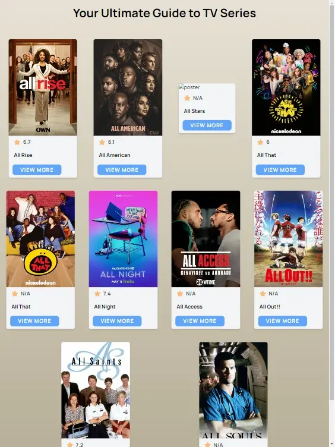

# TV Show Display App

This is a basic UI application to display TV show names along with some details and allow users to view summaries of each show.

# Screenshots

# Desktop

# Tablet

# Mobile

## Features

- Displays a list of TV show names with accompanying details.
- Each show has a button to view its summary.
- Clicking on the summary button redirects the user to another screen showing the summary of the selected show.

## Technologies Used

- React.js
- TailwindCss
- React Router Dom
- Axios

## API Structure

The app uses an API to fetch TV show data. Each show in the API includes a summary section, which is displayed when the user clicks on the "View Summary" button.
